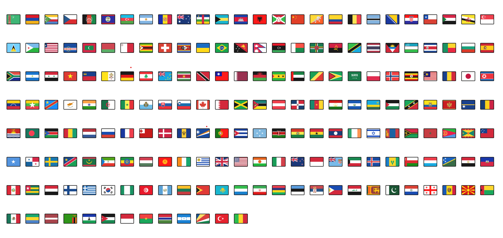
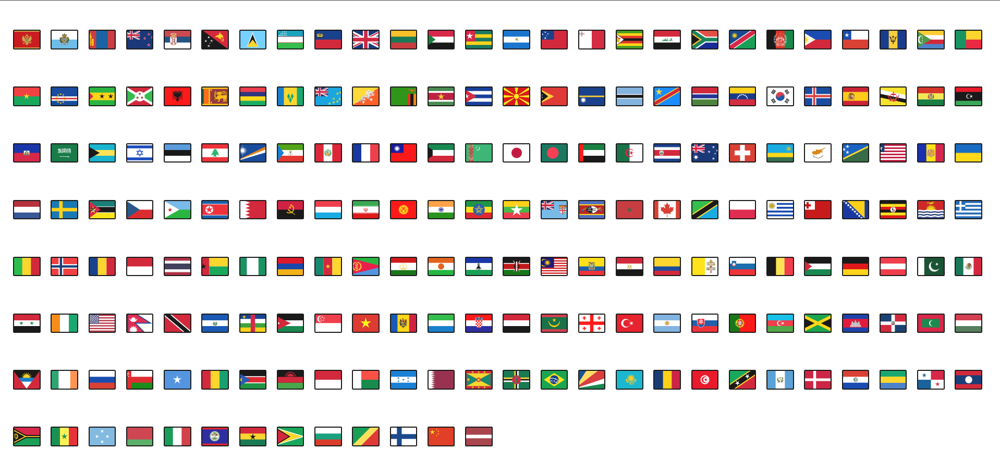

# Country Flags Display

A React application that displays a randomized collection of country flags using the `react-world-flags` package.

## Description

This project creates a simple React component that:
- Imports country flags using the `react-world-flags` package
- Displays flags for 200+ countries using ISO 3166-1 alpha-2 country codes
- Randomly shuffles the flag order on each page load.
- Uses CSS for styling the flag grid layout

## Features

- Randomized flag display on each render
- Responsive grid layout
- Clean and simple implementation
- Uses standard ISO country codes

## Prerequisites

- Node.js (v14 or higher recommended)
- npm (v6 or higher recommended)

## Installation

1. Clone the repository: git clone [https://github.com/MOHDAQIBALAM/Flags-Positions.git]

## Install Dependencies

cd> npm install

## Start the development
cd> npm start

## Usage

This project uses the react-world-flags package to render country flags dynamically. Flags are shuffled upon component mount, ensuring a random order each time.

## Dependencies

React
react-world-flags

## Screenshots

